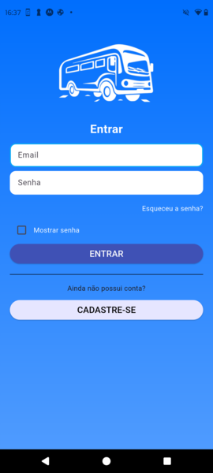
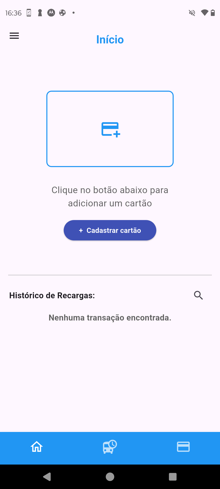
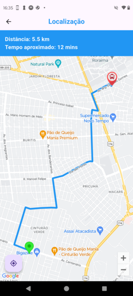
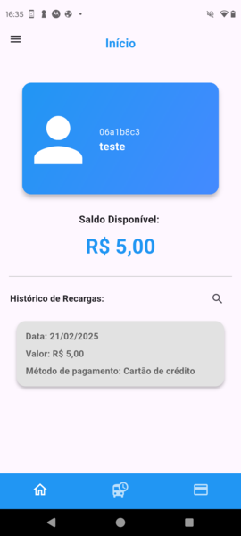

# 📌 Sistema computacional de Gerenciamento de Crédito de Cartões com NFC e Rastreamento via GPS de Transporte Público

## 📘 Visão Geral
Este projeto é uma Monografia de Graduação apresentada ao Departamento de Ciência da Computação da Universidade Federal de Roraima como requisito parcial para a obtenção do grau de bacharel em Ciência da Computação. Para uma descrição detalhada do desenvolvimento do sistema e sua avaliação experimental, acesse a documentação completa do meu TCC [aqui](./TCC2_LucasPrado.pdf).

## 📖 Resumo
Este sistema dividido em um aplicativo desenvolvido em Flutter para o gerenciamento de cartões de ônibus, utilizando tecnologia **NFC** e um sistema embarcado baseado em um microcontrolador **ESP32** com o código em C++. Este sistema embarcado inclui um módulo GPS (GY NEO-6MV2), um leitor RFID (RFID RC522), ambas as partes serão conectadas ao banco de dados **Firebase**. O aplicativo permite recarga de créditos, consulta de saldo e localização dos ônibus utilizando **Google Maps API** e serviços de geolocalização.

## 🚀 Funcionalidades Principais

### 🎫 Gerenciamento de Cartões NFC
- Registro de cartões via **NFC** ou manualmente.
- Exibição do saldo disponível no cartão.
- Atualização do saldo em tempo real via **Firebase Firestore**.
- Exibição de histórico de recargas com detalhes

### 🗺️ Rastreamento de Ônibus
- Exibição da localização do ônibus em tempo real.
- Cálculo da distância e tempo estimado entre o usuário e o ônibus.
- Atualização automática da rota e posição do ônibus.

### 🔑 Autenticação com Firebase
- Login e cadastro de usuários.
- Logout e gerenciamento de sessão.

## 🛠️ Tecnologias Utilizadas

- **Flutter** (Framework principal)
- **Firebase Authentication** (Gerenciamento de usuários)
- **Firebase Firestore** (Banco de dados em nuvem)
- **Google Maps API** (Mapas e geolocalização)
- **NFC Manager** (Leitura e gravação de cartões NFC)
- **API MercadoPago** (Pagamento dos créditos)
- **Node.js (Webhook)** (Confirmação de pagamento)
- **WebSockets** (comunicação webhook e app)
- **ESP32 + Módulo GPS + Módulo RFID** (Para envio de coordenadas e simulação de dedução de passagem)

## 📸 Protótipos e Telas do Aplicativo

|  |  |  |
|----------------------------------------------|--------------------------------------|--------------------------------------|
| **Sistema Ônibus**                           | **Tela de Login**                   | **Home Sem Cartão**                 |

|  |  | |
|-----------------------------------------------------|----------------------------------------------|--------------------------------------------------|
| **Rastreio de Ônibus**                            | **Tela de Recarga**                          | **Home Com Cartão**                              |

## 🎥 Video do experimento mostrando o rastreio do ônibus via GPS

https://github.com/user-attachments/assets/1307e1ec-d145-409c-9147-fdea1caac300

## 🚀 Como Instalar e Executar

Para instruções detalhadas de instalação e execução do projeto, acesse o [README interno](./FlutterAppBus/README.md).

## 📚 Referências Técnicas

- **Login com Firebase no Flutter**  
  - 🎥 [Parte 1: Configuração e Login](https://www.youtube.com/watch?v=2VQEossWnxY&t=200s&ab_channel=jferreiraz)  
  - 🎥 [Parte 2: Coletando informações do usuário](https://youtu.be/g_H0cseD5Fc)  

- **Envio de dados JSON para Firebase Firestore no ESP32**  
  - 🎥 [Vídeo Tutorial](https://www.youtube.com/watch?v=dQRc7pefJ7k&t=411s&ab_channel=TFKioT)  

---

